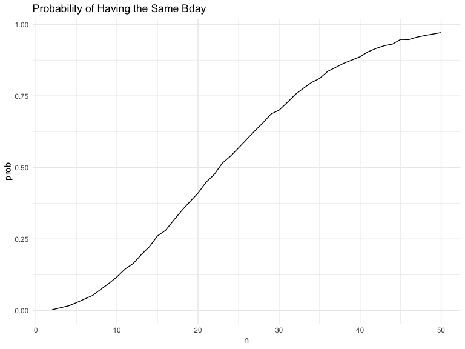
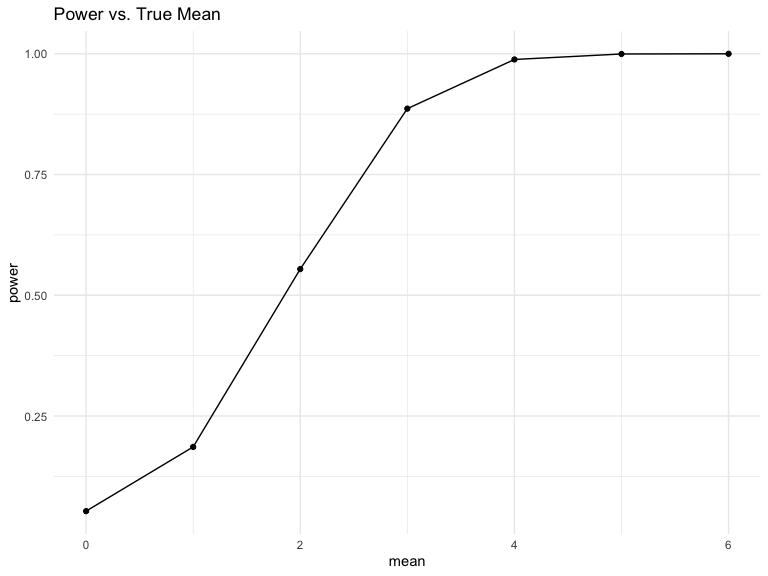
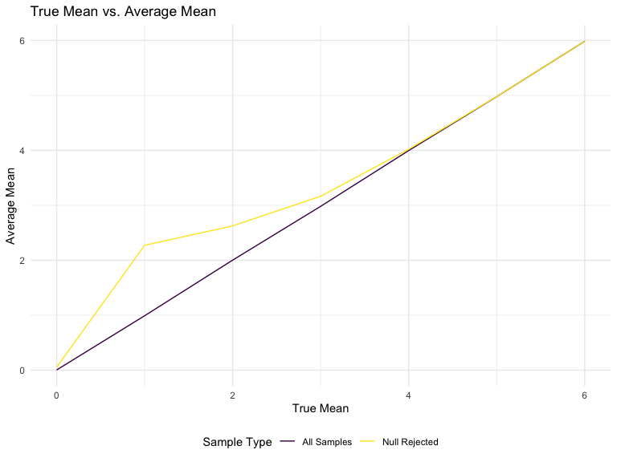

p8105_hw5_brm2150
================
Brooklynn McNeil
2024-11-03

## Problem 1

Let’s put people in a room. Going to assume that no one was born on leap
day and birthdays are normally distributed across the year.

Create a function for size (n) that will tell us if there is a duplicate
birthday in the group.

``` r
bday_sim = function(n) {
  
  bdays = sample(1:365, size = n, replace = TRUE)

  duplicate = length(unique(bdays)) < n
  
  return(duplicate)
  
}

bday_sim(50)
```

    [1] TRUE

Now let’s iterate this for 2 to 50 people in the room. Then iterate
10,000 times, saving each in a data frame.

``` r
sim_res = 
  expand_grid(
    n = c(2:50),
    iter = 1:10000
  ) |>
  mutate(res = map_lgl(n, bday_sim)) |>
  group_by(n) |>
  summarize(prob = mean(res))
```

Now let’s plot the results as a function of n. We see that as n
increases the probability of having two people in the same room having
the same birthday also increases. after about only 22 people are in the
room our chance of success is about 50%.

``` r
sim_res |>
  ggplot(aes(x = n, y = prob)) +
  geom_line() +
  labs(title = "Probability of Having the Same Bday")
```



## Problem 2

Let’s create a function for creating a normal distribution and then do a
t.test.

``` r
rnorm_t.test = function(u){
  
  samp = rnorm(n = 30, mean = u, sd = 5)
  
  broom::tidy(t.test(samp, mu =0, conf.level = 0.95))
}

rnorm_t.test(u=0)
```

    # A tibble: 1 × 8
      estimate statistic p.value parameter conf.low conf.high method     alternative
         <dbl>     <dbl>   <dbl>     <dbl>    <dbl>     <dbl> <chr>      <chr>      
    1    0.168     0.210   0.835        29    -1.46      1.80 One Sampl… two.sided  

Now let’s create a simulation for different mu values and 5000
iterations each.

``` r
sim_samp = 
  expand_grid(
    mean = 0:6,
    iter = 1:5000) |>
  mutate(samp = map(mean,rnorm_t.test)) |>
  unnest(samp)
```

Plot the true mean versus the power of the test, the number of times the
null was rejected.

``` r
power_data = 
  sim_samp |>
  group_by(mean) |>
  summarize(power = mean(p.value< 0.05))

power_data |>
  ggplot(aes(x = mean, y = power)) +
  geom_point() +
  geom_line() +
  labs(title = "Power vs. True Mean")
```



Plot the estimate versus the true mean. and then the estimate only for
times when the null was rejected.

``` r
estimates = 
  sim_samp |>
  group_by(mean) |>
  summarize(avg_mean = mean(estimate),
            avg_mean_rejected = mean(estimate[p.value < 0.05]))

estimates |>
  ggplot(aes(x = mean)) +
  geom_line(aes(y = avg_mean, color = "All Samples")) +
  geom_line(aes(y = avg_mean_rejected, color = "Null Rejected")) +
  labs(title = "True Mean vs. Average Mean",
       x = "True Mean",
       y = "Average Mean",
       color = "Sample Type")
```


The average mean for all samples is very close to the true mean, but is
quite skewed for the subset that rejected the null. Rejecting the null
caused a skew in the data, especially for true mean of 1 and 2. As the
true mean increases, the selection bias diminishes.

## Problem 3
