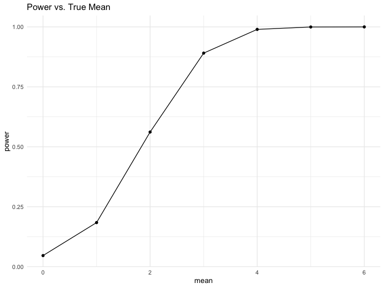

p8105_hw5_brm2150
================
Brooklynn McNeil
2024-11-03

## Problem 1

Let’s put people in a room. Going to assume that no one was born on leap
day and birthdays are normally distributed across the year.

Create a function for size (n) that will tell us if there is a duplicate
birthday in the group.

``` r
bday_sim = function(n) {
  
  bdays = sample(1:365, size = n, replace = TRUE)

  duplicate = length(unique(bdays)) < n
  
  return(duplicate)
  
}

bday_sim(50)
```

    [1] TRUE

Now let’s iterate this for 2 to 50 people in the room. Then iterate
10,000 times, saving each in a data frame.

``` r
sim_res = 
  expand_grid(
    n = c(2:50),
    iter = 1:10000
  ) |>
  mutate(res = map_lgl(n, bday_sim)) |>
  group_by(n) |>
  summarize(prob = mean(res))
```

Now let’s plot the results as a function of n. We see that as n
increases the probability of having two people in the same room having
the same birthday also increases. after about only 22 people are in the
room our chance of success is about 50%.

``` r
sim_res |>
  ggplot(aes(x = n, y = prob)) +
  geom_line() +
  labs(title = "Probability of Having the Same Bday")
```


## Problem 2

Let’s create a function for creating a normal distribution and then do a
t.test.

``` r
rnorm_t.test = function(u){
  
  samp = rnorm(n = 30, mean = u, sd = 5)
  
  broom::tidy(t.test(samp, mu =0, conf.level = 0.95))
}

rnorm_t.test(u=0)
```

    # A tibble: 1 × 8
      estimate statistic p.value parameter conf.low conf.high method     alternative
         <dbl>     <dbl>   <dbl>     <dbl>    <dbl>     <dbl> <chr>      <chr>      
    1    -1.04     -1.31   0.199        29    -2.65     0.577 One Sampl… two.sided  

Now let’s create a simulation for different mu values and 5000
iterations each.

``` r
sim_samp = 
  expand_grid(
    mean = 0:6,
    iter = 1:5000) |>
  mutate(samp = map(mean,rnorm_t.test)) |>
  unnest(samp)
```

Plot the true mean versus the power of the test, the number of times the
null was rejected.

``` r
power_data = 
  sim_samp |>
  group_by(mean) |>
  summarize(power = mean(p.value< 0.05))

power_data |>
  ggplot(aes(x = mean, y = power)) +
  geom_point() +
  geom_line() +
  labs(title = "Power vs. True Mean")
```



Plot the estimate versus the true mean. and then the estimate only for
times when the null was rejected.

``` r
estimates = 
  sim_samp |>
  group_by(mean) |>
  summarize(avg_mean = mean(estimate),
            avg_mean_rejected = mean(estimate[p.value < 0.05]))

estimates |>
  ggplot(aes(x = mean)) +
  geom_line(aes(y = avg_mean, color = "All Samples")) +
  geom_line(aes(y = avg_mean_rejected, color = "Null Rejected")) +
  labs(title = "True Mean vs. Average Mean",
       x = "True Mean",
       y = "Average Mean",
       color = "Sample Type")
```


The average mean for all samples is very close to the true mean, but is
quite skewed for the subset that rejected the null. Rejecting the null
caused a skew in the data, especially for true mean of 1 and 2. As the
true mean increases, the selection bias diminishes.

## Problem 3

``` r
url = "https://raw.githubusercontent.com/washingtonpost/data-homicides/master/homicide-data.csv"
homicide_dat = 
  read_csv(url, na = "Unknown") |>
  mutate(city_state = str_c(city, "_", state))
```

    Warning: One or more parsing issues, call `problems()` on your data frame for details,
    e.g.:
      dat <- vroom(...)
      problems(dat)

    Rows: 52179 Columns: 12
    ── Column specification ────────────────────────────────────────────────────────
    Delimiter: ","
    chr (8): uid, victim_last, victim_first, victim_race, victim_sex, city, stat...
    dbl (4): reported_date, victim_age, lat, lon

    ℹ Use `spec()` to retrieve the full column specification for this data.
    ℹ Specify the column types or set `show_col_types = FALSE` to quiet this message.

``` r
head(homicide_dat)
```

    # A tibble: 6 × 13
      uid   reported_date victim_last victim_first victim_race victim_age victim_sex
      <chr>         <dbl> <chr>       <chr>        <chr>            <dbl> <chr>     
    1 Alb-…      20100504 GARCIA      JUAN         Hispanic            78 Male      
    2 Alb-…      20100216 MONTOYA     CAMERON      Hispanic            17 Male      
    3 Alb-…      20100601 SATTERFIELD VIVIANA      White               15 Female    
    4 Alb-…      20100101 MENDIOLA    CARLOS       Hispanic            32 Male      
    5 Alb-…      20100102 MULA        VIVIAN       White               72 Female    
    6 Alb-…      20100126 BOOK        GERALDINE    White               91 Female    
    # ℹ 6 more variables: city <chr>, state <chr>, lat <dbl>, lon <dbl>,
    #   disposition <chr>, city_state <chr>

The raw data contains information about homicides across 50 cities. The
range of victim age is NA, NA. Below is a table of total homicides for
each city as well as the unsolved murders.

``` r
homicide_dat |>
  group_by(city_state) |>
  summarize(Total_Homicides = n(),
            Unsolved_Homcides = sum(disposition %in% c("Open/No arrest", "Closed without arrest")))|>
  knitr::kable()
```

| city_state        | Total_Homicides | Unsolved_Homcides |
|:------------------|----------------:|------------------:|
| Albuquerque_NM    |             378 |               146 |
| Atlanta_GA        |             973 |               373 |
| Baltimore_MD      |            2827 |              1825 |
| Baton Rouge_LA    |             424 |               196 |
| Birmingham_AL     |             800 |               347 |
| Boston_MA         |             614 |               310 |
| Buffalo_NY        |             521 |               319 |
| Charlotte_NC      |             687 |               206 |
| Chicago_IL        |            5535 |              4073 |
| Cincinnati_OH     |             694 |               309 |
| Columbus_OH       |            1084 |               575 |
| Dallas_TX         |            1567 |               754 |
| Denver_CO         |             312 |               169 |
| Detroit_MI        |            2519 |              1482 |
| Durham_NC         |             276 |               101 |
| Fort Worth_TX     |             549 |               255 |
| Fresno_CA         |             487 |               169 |
| Houston_TX        |            2942 |              1493 |
| Indianapolis_IN   |            1322 |               594 |
| Jacksonville_FL   |            1168 |               597 |
| Kansas City_MO    |            1190 |               486 |
| Las Vegas_NV      |            1381 |               572 |
| Long Beach_CA     |             378 |               156 |
| Los Angeles_CA    |            2257 |              1106 |
| Louisville_KY     |             576 |               261 |
| Memphis_TN        |            1514 |               483 |
| Miami_FL          |             744 |               450 |
| Milwaukee_wI      |            1115 |               403 |
| Minneapolis_MN    |             366 |               187 |
| Nashville_TN      |             767 |               278 |
| New Orleans_LA    |            1434 |               930 |
| New York_NY       |             627 |               243 |
| Oakland_CA        |             947 |               508 |
| Oklahoma City_OK  |             672 |               326 |
| Omaha_NE          |             409 |               169 |
| Philadelphia_PA   |            3037 |              1360 |
| Phoenix_AZ        |             914 |               504 |
| Pittsburgh_PA     |             631 |               337 |
| Richmond_VA       |             429 |               113 |
| Sacramento_CA     |             376 |               139 |
| San Antonio_TX    |             833 |               357 |
| San Bernardino_CA |             275 |               170 |
| San Diego_CA      |             461 |               175 |
| San Francisco_CA  |             663 |               336 |
| Savannah_GA       |             246 |               115 |
| St. Louis_MO      |            1677 |               905 |
| Stockton_CA       |             444 |               266 |
| Tampa_FL          |             208 |                95 |
| Tulsa_AL          |               1 |                 0 |
| Tulsa_OK          |             583 |               193 |
| Washington_DC     |            1345 |               589 |

Let’s look at the proportion of murders solved in Baltimore, Maryland.

``` r
baltimore_dat = 
  homicide_dat |>
  filter(city_state == "Baltimore_MD") |>
  mutate(status = case_when(
    disposition %in% c("Closed without arrest", "Closed by arrest") ~ 0,
    disposition == "Open/No arrest" ~ 1
  )) 
total = 
  baltimore_dat |>
  drop_na(status)|>
  nrow()
unsolved = 
  baltimore_dat |> 
  pull(status) |> 
  sum()

prop.test(unsolved, total) |>
  broom::tidy() |>
  select(estimate, conf.low, conf.high)
```

    # A tibble: 1 × 3
      estimate conf.low conf.high
         <dbl>    <dbl>     <dbl>
    1    0.592    0.573     0.610

Now let’s map a prop.test across each city.

``` r
city_summary = 
  homicide_dat |>
  mutate(status = case_when(
    disposition %in% c("Closed without arrest", "Closed by arrest") ~ 0,
    disposition == "Open/No arrest" ~ 1),
    city_state = as.factor(str_c(city, "_", state))
    )|>
  group_by(city_state) |>
  summarize(total = n(),
            unsolved = sum(status))

city_prop = 
  city_summary |>
  mutate(prop_test = map2(.x = unsolved, .y = total, ~ prop.test(.x, .y) |> broom::tidy())
         ) |>
  unnest(prop_test)|>
  select(city_state, estimate, conf.low, conf.high)
```

    Warning: There was 1 warning in `mutate()`.
    ℹ In argument: `prop_test = map2(.x = unsolved, .y = total,
      ~broom::tidy(prop.test(.x, .y)))`.
    Caused by warning in `prop.test()`:
    ! Chi-squared approximation may be incorrect

``` r
city_prop |> 
  knitr::kable(digits = 3)
```

| city_state        | estimate | conf.low | conf.high |
|:------------------|---------:|---------:|----------:|
| Albuquerque_NM    |    0.249 |    0.207 |     0.296 |
| Atlanta_GA        |    0.324 |    0.295 |     0.354 |
| Baltimore_MD      |    0.592 |    0.573 |     0.610 |
| Baton Rouge_LA    |    0.425 |    0.377 |     0.473 |
| Birmingham_AL     |    0.354 |    0.321 |     0.388 |
| Boston_MA         |    0.505 |    0.465 |     0.545 |
| Buffalo_NY        |    0.597 |    0.553 |     0.639 |
| Charlotte_NC      |    0.236 |    0.205 |     0.270 |
| Chicago_IL        |    0.666 |    0.653 |     0.678 |
| Cincinnati_OH     |    0.375 |    0.339 |     0.412 |
| Columbus_OH       |    0.457 |    0.427 |     0.487 |
| Dallas_TX         |    0.431 |    0.407 |     0.456 |
| Denver_CO         |    0.394 |    0.340 |     0.451 |
| Detroit_MI        |    0.582 |    0.562 |     0.601 |
| Durham_NC         |    0.326 |    0.272 |     0.385 |
| Fort Worth_TX     |    0.401 |    0.360 |     0.443 |
| Fresno_CA         |    0.300 |    0.260 |     0.343 |
| Houston_TX        |    0.390 |    0.372 |     0.408 |
| Indianapolis_IN   |    0.372 |    0.346 |     0.399 |
| Jacksonville_FL   |    0.390 |    0.362 |     0.419 |
| Kansas City_MO    |    0.378 |    0.351 |     0.406 |
| Las Vegas_NV      |    0.287 |    0.264 |     0.312 |
| Long Beach_CA     |    0.341 |    0.294 |     0.392 |
| Los Angeles_CA    |    0.490 |    0.469 |     0.511 |
| Louisville_KY     |    0.453 |    0.412 |     0.495 |
| Memphis_TN        |    0.286 |    0.263 |     0.310 |
| Miami_FL          |    0.520 |    0.484 |     0.557 |
| Milwaukee_wI      |    0.328 |    0.301 |     0.357 |
| Minneapolis_MN    |    0.426 |    0.375 |     0.479 |
| Nashville_TN      |    0.288 |    0.257 |     0.322 |
| New Orleans_LA    |    0.580 |    0.554 |     0.606 |
| New York_NY       |    0.360 |    0.323 |     0.400 |
| Oakland_CA        |    0.536 |    0.504 |     0.569 |
| Oklahoma City_OK  |    0.469 |    0.431 |     0.507 |
| Omaha_NE          |    0.389 |    0.342 |     0.438 |
| Philadelphia_PA   |    0.418 |    0.400 |     0.435 |
| Phoenix_AZ        |    0.446 |    0.414 |     0.479 |
| Pittsburgh_PA     |    0.534 |    0.494 |     0.573 |
| Richmond_VA       |    0.217 |    0.179 |     0.259 |
| Sacramento_CA     |    0.309 |    0.263 |     0.358 |
| San Antonio_TX    |    0.324 |    0.293 |     0.357 |
| San Bernardino_CA |    0.549 |    0.488 |     0.609 |
| San Diego_CA      |    0.241 |    0.203 |     0.283 |
| San Francisco_CA  |    0.505 |    0.467 |     0.544 |
| Savannah_GA       |    0.419 |    0.357 |     0.483 |
| St. Louis_MO      |    0.516 |    0.492 |     0.540 |
| Stockton_CA       |    0.574 |    0.527 |     0.621 |
| Tampa_FL          |    0.418 |    0.351 |     0.489 |
| Tulsa_AL          |    0.000 |    0.000 |     0.945 |
| Tulsa_OK          |    0.237 |    0.203 |     0.274 |
| Washington_DC     |    0.383 |    0.357 |     0.410 |

Plotting the cities with the proportion of unsolved homicides with
confidence intervals.

``` r
city_prop |>
  arrange(desc(estimate)) |>
  mutate(city_state = factor(city_state, levels = city_state)) |>
  ggplot(aes(x = city_state, y = estimate)) +
  geom_point() +
  geom_errorbar(aes(ymin = conf.low, ymax = conf.high)) +
  theme_minimal() +
  theme(
    axis.text.x = element_text(angle = 45, hjust = 1))+
  labs(
    title = "Proportion of Unsolved Homicides by City",
    x = "City and State",
    y = "Estimated Proportion of unsolved Homicides"
  )
```


